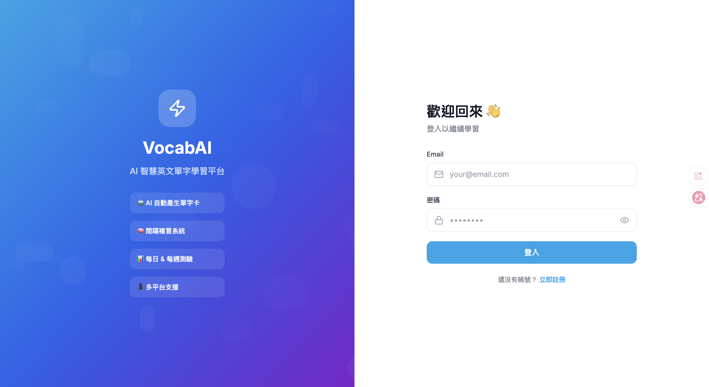
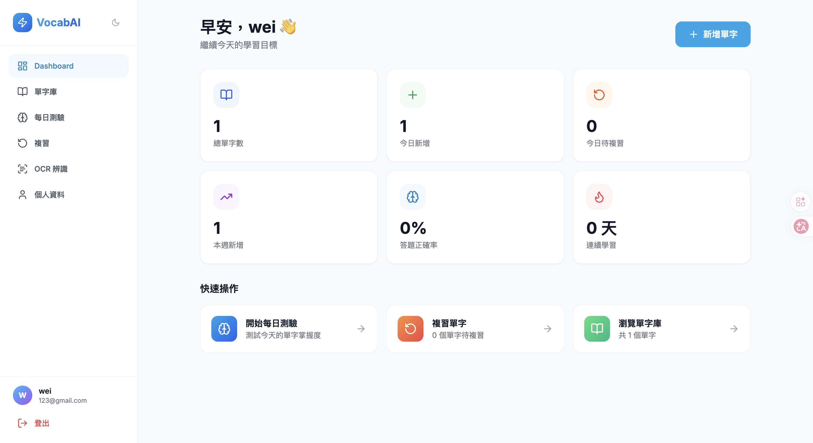
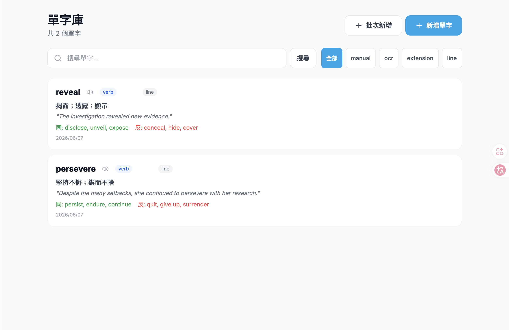
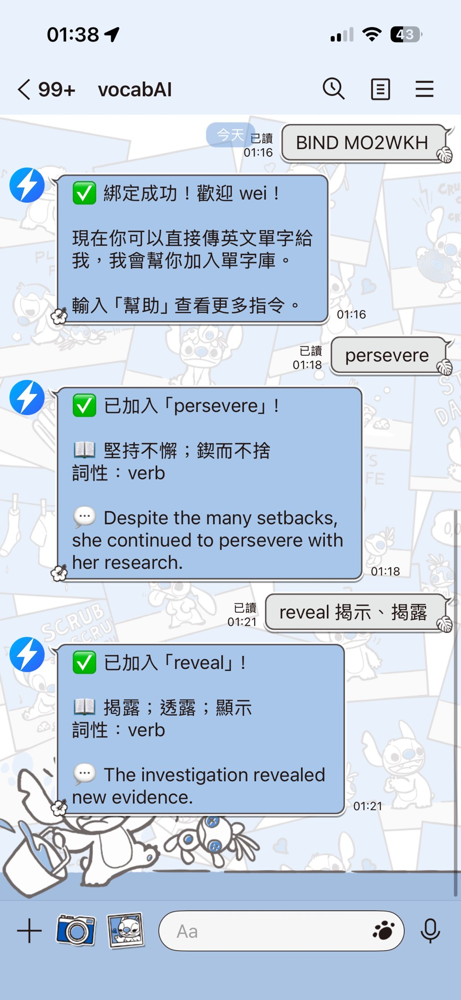

<p align="center">
  
</p>

<h1 align="center">⚡ VocabAI</h1>
<p align="center">AI 智慧英文單字學習平台</p>

<p align="center">
  
  
  
  
  
</p>

<p align="center">
  <a href="https://vocabai-frontend.onrender.com">
    
  </a>
</p>

> ⚠️ 使用 Render 免費方案，閒置一段時間後服務會休眠，第一次開啟需等約 30 秒。

---

## 📸 畫面預覽

| 登入頁面 | Dashboard |
|---------|-----------|
|  |  |

| 單字庫 | LINE Bot |
|--------|---------|
|  |  |

---

## ✨ 功能總覽

### 🤖 AI 單字卡
新增單字後自動呼叫 Gemini AI 產生：
- 中文解釋、詞性、英文例句、同義詞、反義詞
- 使用者自填的欄位 AI **不會覆蓋**

### 🧠 間隔複習（Spaced Repetition）
```
Day 1 → Day 3 → Day 7 → Day 14 → Day 30
答對 ↑ 升級　　答錯 ↓ 降級
```

### 📝 測驗系統
- 每日測驗：選擇題 / 填空題 / 中翻英
- 每週測驗：本週新增單字
- 結果頁顯示每題正確答案

### 📱 多平台支援
| 平台 | 功能 |
|------|------|
| 🌐 網站 | 完整學習功能 |
| 🤖 LINE Bot | 傳單字 → AI 即時回覆 + 存入單字庫 |
| 🔌 Chrome Extension | 右鍵選字 → 加入單字庫 |
| 📷 OCR | 上傳圖片 → Gemini 辨識 → 提取單字 |

### 其他功能
- 🔊 單字發音（Web Speech API）
- 📦 批次新增單字
- 🌙 深色模式
- 🔥 連續學習天數
- 📊 Dashboard 學習總覽

---

## 🏗️ 技術架構

```
┌─────────────────────────────────────────────┐
│                  Frontend                    │
│         Next.js 15 + TailwindCSS            │
└────────────────────┬────────────────────────┘
                     │ REST API
┌────────────────────▼────────────────────────┐
│                  Backend                     │
│              FastAPI + SQLAlchemy            │
├─────────────────────────────────────────────┤
│  Gemini AI  │  PostgreSQL  │  JWT Auth      │
└─────────────────────────────────────────────┘
```

| 層級 | 技術 |
|------|------|
| Frontend | Next.js 15 + TypeScript + TailwindCSS |
| Backend | FastAPI + SQLAlchemy |
| Database | PostgreSQL 16 |
| AI | Google Gemini 2.5 Flash |
| Auth | JWT（7 天有效期） |
| Deployment | Render |

---

## 🚀 本地開發

### 前置需求
- Docker（跑 PostgreSQL）
- Python 3.11+
- Node.js 20+
- Google Gemini API Key

### 快速啟動

**1️⃣ 啟動資料庫**
```bash
docker compose -f docker-compose.dev.yml up -d
```

**2️⃣ 啟動 Backend**
```bash
cd backend
python3 -m venv venv5
source venv5/bin/activate
pip install -r requirements.txt
cp .env.example .env
# 填入 GEMINI_API_KEY
venv5/bin/uvicorn app.main:app --reload --port 8080
```

**3️⃣ 啟動 Frontend**
```bash
cd frontend
npm install --legacy-peer-deps
echo "NEXT_PUBLIC_API_URL=http://localhost:8080" > .env.local
npm run dev
```

| 服務 | 網址 |
|------|------|
| 🌐 Frontend | http://localhost:3000 |
| ⚡ API 文件 | http://localhost:8080/docs |

---

## 🔌 Chrome Extension 安裝

```
1. 打開 chrome://extensions
2. 開啟「開發人員模式」
3. 點「載入未封裝項目」→ 選擇 extension/ 資料夾
4. 點擊工具列的 VocabAI icon 登入
5. 選取網頁文字 → 右鍵 → 加入 VocabAI ✓
```

---

## 🤖 LINE Bot 設定

```
1. LINE Developers → 建立 Messaging API Channel
2. 取得 Channel Secret + Channel Access Token
3. Webhook URL：https://vocabai-backend.onrender.com/api/line/webhook
4. 開啟 Use webhook ✓
5. 將 Token 填入 Render 環境變數
```

**綁定流程：**
```
網站「個人資料」→ 產生綁定碼 → LINE 傳送 BIND XXXXXX → 綁定成功 ✅
```

**LINE 指令：**
```
sustain        → 查詢並加入單字庫
幫助           → 顯示指令列表
單字數         → 查看目前單字數量
```

---

## 📁 專案結構

```
VocabAI/
├── 🐍 backend/
│   └── app/
│       ├── models/      # User, Word, Quiz, ReviewSchedule
│       ├── schemas/     # Pydantic 驗證
│       ├── routers/     # auth, words, quiz, review, ocr, line_bot...
│       └── services/    # Gemini AI, Spaced Repetition
├── ⚛️  frontend/
│   └── src/
│       ├── app/         # 所有頁面
│       ├── components/  # Sidebar, AppLayout
│       └── hooks/       # useAuth (Zustand)
├── 🔌 extension/        # Chrome Extension
├── 🐳 docker-compose.yml
└── 📄 .env.example
```

---

## ❓ 常見問題

<details>
<summary>新增單字後沒有 AI 解釋？</summary>
AI 在背景執行，等幾秒後刷新頁面。若仍無效，確認 GEMINI_API_KEY 是否正確設定。
</details>

<details>
<summary>LINE Bot 沒有回應？</summary>
確認 LINE Developers 有開啟 Use webhook，且 Webhook URL 填入正確。
</details>

<details>
<summary>Render 服務很慢？</summary>
免費方案閒置後會休眠，第一個 request 需等約 30 秒喚醒。
</details>

<details>
<summary>如何重置本地資料庫？</summary>

```bash
docker compose down -v
docker compose -f docker-compose.dev.yml up -d
```
</details>

---

<p align="center">Made with ❤️ by VocabAI Team</p>
